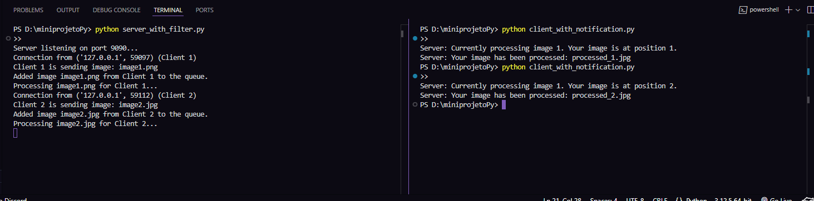

# Sistema Distribuído de Processamento de Imagens

Este projeto demonstra um sistema distribuído que processa imagens em paralelo usando Python. Consiste em uma arquitetura cliente-servidor, onde o servidor aplica um filtro às imagens enviadas pelos clientes e notifica os clientes sobre o status do processamento. Além disso, o projeto explora conceitos de threading, comunicação cliente-servidor e notificações em sistemas distribuídos.

## Estrutura do Projeto

O projeto é dividido em três partes:

### 1. **Filtro de Imagens com Paralelismo**
   - O servidor processa imagens em paralelo usando threads, aplicando um filtro a cada imagem.
   - Cada cliente envia uma imagem para o servidor, que processa a imagem e retorna o resultado filtrado.

   **Imagens:**
   - Antes: 
   - Depois: 

   - Antes: 
   - Depois: 

### 2. **Modelos Cliente-Servidor e Peer-to-Peer**
   - **Modelo Cliente-Servidor:** Um servidor multi-threaded escuta conexões de clientes, processa solicitações e responde simultaneamente.
   - **Modelo Peer-to-Peer (P2P):** Cada nó na rede atua como servidor e cliente, permitindo a comunicação entre nós.

### 3. **Sistema de Notificação e Unificação**
   - O servidor processa imagens e envia notificações aos clientes sobre o progresso.
   - Exemplo de notificação: "Atualmente, está sendo processada a imagem 3. A sua é a n5."

   **Exibição da Resposta do Servidor ao Cliente:**
   

## Executando o Projeto

1. **Instalações Necessárias:**
   - Certifique-se de ter o Python 3.x instalado.
   - Instale a biblioteca Pillow para manipulação de imagens:
     ``` 
     pip install Pillow
     ```

2. **Arquivos do Projeto:**
   - `server_with_filter.py`: O servidor que processa as imagens e envia notificações.
   - `client_with_notification.py`: O cliente que envia imagens ao servidor e recebe as notificações.

3. **Executando o Servidor:**
   - Abra um terminal e execute o comando:
     ``` 
     python server_with_filter.py 
     ```

4. **Executando o Cliente:**
   - Em outro terminal, execute o cliente para enviar uma imagem:
     ``` 
     python client_with_notification.py 
     ```
   - Altere `client_with_notification.py` para usar o nome da imagem que deseja processar.

## Contribuições
Sinta-se à vontade para contribuir com melhorias, sugestões ou correções!

## Licença
Este projeto está licenciado sob a MIT License.
